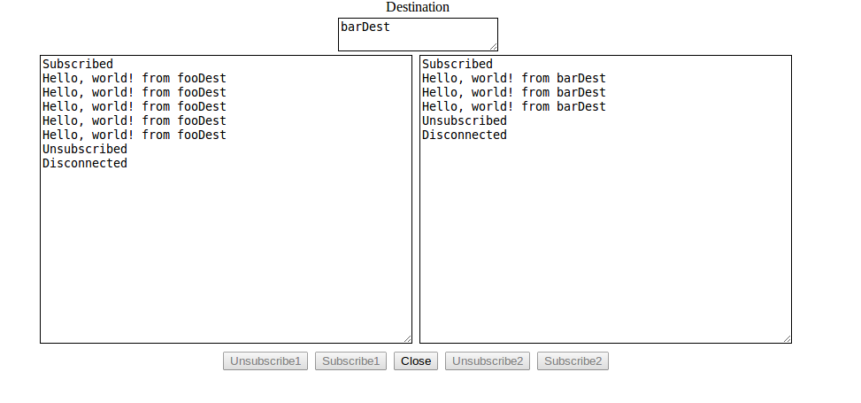

WebSocket Pub/Sub Server with Pluggable Services
=================================================

The core component is the `org.springframework.integration.x.ip.wsserver.Server`.

It provides an abstraction over sub-protocols (such as Stomp).

Sub-protocol handshaking (e.g. Stomp.CONNECT), is delegated to a `ProtocolHandler` after determining
which one can handle the message.

When a subscribe message is received, the `ws_destination` header is used to detemine which child
context gets the message (via its `subscriptions` channel).

It also provides a telnet server for management (adding, removing services, etc).

Currently, Stomp is the only supported sub-protocol, but anything that has a CONNECT, SUBSCRIBE, UNSUBSCRIBE, DISCONNECT paradigm can be added.

In essence, the server runs in a parent context with a child context for each service; this allows the Server to send subscription messages into the child context, while allowing the child contexts to write to the browser.

There is a demo 'FooService' that sends "Hello, world!" to subscriptions every 5 seconds.

To run the demo, run the `Service` class (main).

Telnet into the service from the command line...

    $ telnet localhost 1111

    Trying 127.0.0.1...
    Connected to localhost.
    Escape character is '^]'.
    Welcome to the Spring Integration WebSocket Server
    Available commands:
     list (list all registered services)
     add <service> <context> (add a new service)
     rm <service> (remove a service)
     subs (list current subscriptions)
     quit (shut down the server)

Add the fooDest service

    add fooDest /META-INF/spring/foo-context.xml
    /META-INF/spring/foo-context.xml linked and refreshed as fooDest

Open `test.html` in a browser (`spring-integration-ip-extensions/src/test/java/org/springframework/integration/x/ip/wsserver/test.html`)

    New connection: localhost:35229:fc114a91-7f01-4661-bcb2-255665fda099 on factory wsServer

Click on one or both of the `Subscribe` buttons and you'll start seeing `Hello, world!` every 5 seconds.

List subscriptions

    subs
    Current subscriptions:
     localhost:35229:fc114a91-7f01-4661-bcb2-255665fda099
      subId:sub-1 dest:fooDest
      subId:sub-0 dest:fooDest

Click the `unsubscribe` button(s) on the browser

    subs
    Current subscriptions:
     localhost:35229:fc114a91-7f01-4661-bcb2-255665fda099

(note the connection is still open, but no subs).

Remove the service

    rm fooDest
    org.springframework.context.support.ClassPathXmlApplicationContext@a678505: startup date [Fri Apr 12 09:46:45 EDT 2013]; 
    parent:   org.springframework.context.support.ClassPathXmlApplicationContext@32008dad
     delinked and destroyed as fooDest

Click the `Close` button on the browser

    Closed connection: localhost:35229:fc114a91-7f01-4661-bcb2-255665fda099 on factory wsServer

Shut down the server

    quit
    bye...
    Connection closed by foreign host.

You can play around further - e.g. register the same service under a different destination name and subscribe each pane to each service...

    add barDest /META-INF/spring/foo-context.xml
    /META-INF/spring/foo-context.xml linked and refreshed as barDest
    subs
    Current subscriptions:
     localhost:35702:c0c7cf3b-d430-4e3d-980b-c0b8d0c979ad
      subId:sub-3 dest:barDest
      subId:sub-4 dest:fooDest

In the screenshot, the left pane is subscribed to `fooDest` and right to `barDest`.

